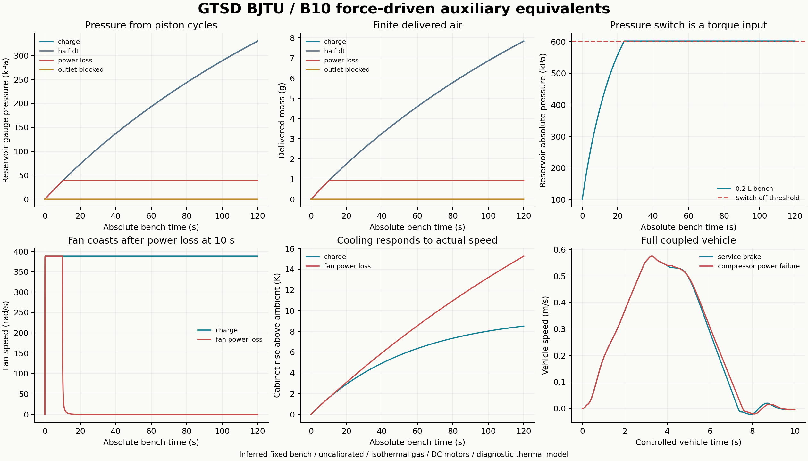

# B10 数值验收

`PASS_WITH_MODEL_LIMITATIONS`：16 项组件测试、36 项控制及未修改 B8 回归通过；3 个完整整车工况和 6 个 120 s 辅机工况的 266 项验收通过。B8/B9 历史验收保持原版本记录。

| 120 s 试验台工况 | 储气罐绝压 kPa | 排入储气罐 g | 柜内温升 K |
|---|---:|---:|---:|
| charge | 431.399 | 7.845024 | 8.514 |
| half_dt | 430.899 | 7.833142 | 8.514 |
| power_loss | 140.674 | 0.935230 | 8.514 |
| outlet_blocked | 101.325 | 0.000000 | 8.514 |
| fan_power_loss | 431.399 | 7.845024 | 15.256 |
| pressure_switch | 601.939 | 1.189831 | 8.514 |

| 6+10 s 整车工况 | 停车距离 m | 末速 m/s | 储气罐末绝压 kPa |
|---|---:|---:|---:|
| service_brake | 1.106992 | -0.004303 | 421.567 |
| half_dt | 1.107058 | -0.004302 | 421.548 |
| compressor_power_failure | 1.164368 | -0.004413 | 390.248 |

整车主步长 0.05 ms、半步长 0.025 ms；停车距离相邻差 0.005927%，沿用 B8 2.5% 阈值。辅机试验台步长 0.2/0.1 ms，120 s 排气质量相邻差 0.151460%。三组整车零 MuJoCo 告警。

泵机械能采样峰残差 1.358e-09 J；试验台质量末残差最大 6.349e-16 kg。电能、气体内能/火用、风机轴功和热容守恒分别核验，详细阈值和哈希见 verification.json。

供气和散热故障改变流量、气压和温升，不修改转子动量、气体质量或温度。理想检查阀、恒温气体、忽略电感、固定安装边界与未标定系数的限制见 README.md。Blender 中额外试验台使用 0.5 s、1 kHz 已求解启动轨迹，33.3 倍慢放；源模型泵壳与格栅不被当作活动机构。

