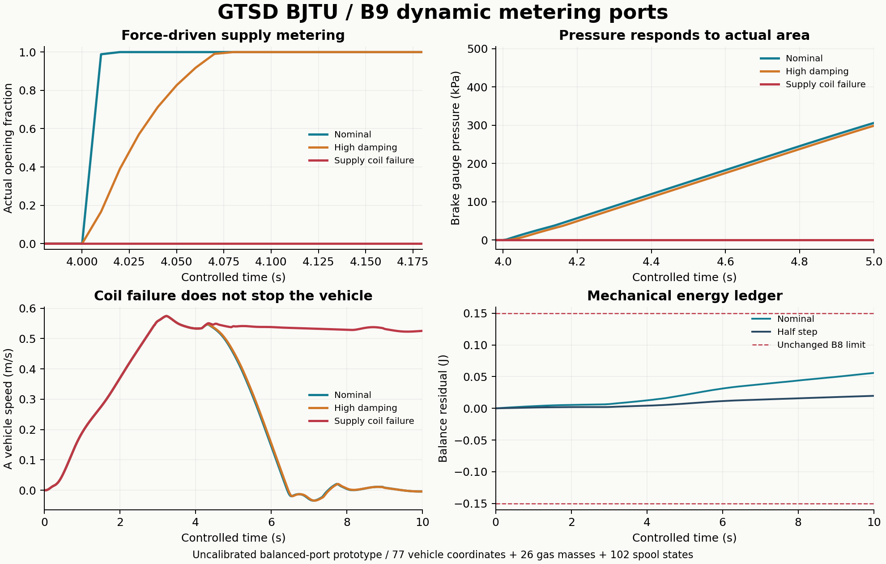

# B9 本次验收结果

状态 `PASS_WITH_MODEL_LIMITATIONS`。19 项阀芯模块检查、35 项控制/旧 B8 回归检查通过；五组完整 B9 工况的 158 项验收检查通过。本次没有重跑 B8 原 22 组全部工况。

| 工况 | 停车距离 m | 制动后停稳 s | 末速 m/s | 机械账本峰残差 J |
|---|---:|---:|---:|---:|
| Nominal | 0.849741 | 4.970 | -0.004001 | 0.055793 |
| Half step | 0.849753 | 4.970 | -0.004001 | 0.019704 |
| High damping | 0.862896 | 4.960 | -0.003903 | 0.055912 |
| Supply coil failure | 未停稳 | — | 0.525246 | 0.050979 |
| Normal exhaust | 0.843186 | 3.910 | 0.000394 | 0.055661 |

主步长 0.05 ms，半步长 0.025 ms。正常制动停车距离相邻差 0.001323%，原 2.5% 阈值保留。停车要求随后至 10 s 窗末 |A 车体速度| < 0.01 m/s，持续至少 0.5 s。

五工况空气质量最大残差 1.655e-15 kg；阀芯能量账本采样峰残差 1.955e-14 J。机械账本使用原 0.15 J 阈值，气机械功差使用原 0.05 J 阈值，动量使用原 0.05 N·s 阈值；全部零 MuJoCo 告警。

正常制动和阀芯迟滞的停车差、失效后仍运行、正常排气与快排差别均来自求解结果。没有指定位姿、规定轮滚动关系或强制停车。完整数字与哈希见 results/verification.json 和各工况 identity JSON。

新增的 51 个压力平衡端口代理有 102 个位置/速度状态，计量孔口跟随实际阀芯，不等于 51 个实物阀。名义参数、外部固定支承及剩余覆盖限制见 README.md。新增阀芯参数、气路和源设备均未实测标定；软线/软管、压缩机内部和风扇仍待物理化。

